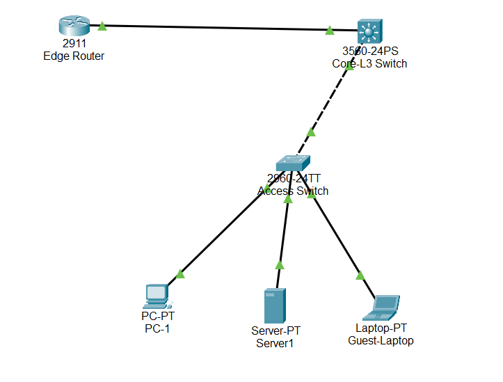
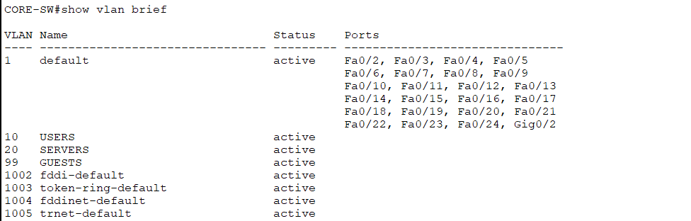
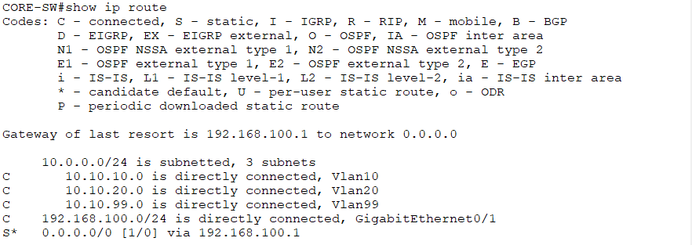

<<<<<<< HEAD
# Enterprise VLAN & OSPF Routing Lab

## Overview
This project simulates an enterprise-style campus network using multilayer switching, VLAN segmentation, DHCP services, ACL-based access control, and OSPF dynamic routing. The lab was designed to demonstrate practical Layer 2 and Layer 3 networking skills in a controlled Cisco environment.

## Objectives
- Implement VLAN segmentation across multiple departments
- Configure inter-VLAN routing using a L3 switch
- Deploy OSPF dynamic routing between core and edge devices
- Provide centralized DHCP services
- Enforce guest network isolation using extended ACLs
- Validate routing and segmentation through structured testing

## Network Topology
The topology consists of:
- 1 Layer 3 Core Switch (3560)
- 1 Layer 2 Access Switch (2960)
- 1 Edge Router (2911)
- 3 End Devices (Users, Server, Guests)

## IP Addressing Scheme

| VLAN | Name    | Subnet         | Gateway        |
|------|---------|---------------|----------------|
| 10   | USERS   | 10.10.10.0/24 | 10.10.10.1     |
| 20   | SERVERS | 10.10.20.0/24 | 10.10.20.1     |
| 99   | GUEST   | 10.10.99.0/24 | 10.10.99.1     |

Core-to-Edge link: 192.168.100.0/24

## Technologies Used
- VLANs & 802.1Q Trunking
- Inter-VLAN Routing (SVIs)
- OSPF Area 0
- DHCP Configuration
- Extended Access Control Lists
- Cisco IOS CLI

## Key Configuration Highlights

### OSPF Configuration
- Configured OSPF process 1
- Advertised all VLAN networks into Area 0
- Verified adjacency using `show ip ospf neighbor`

### ACL Implementation
- Implemented extended ACL to prevent GUEST VLAN access to SERVER VLAN
- Applied ACL inbound on VLAN 99 SVI

## Verification & Testing
- Verified VLAN membership (`show vlan brief`) 
- Confirmed OSPF adjacency (`show ip ospf neighbor`) 
- Validated routing table entries (`show ip route`) 
- Confirmed DHCP bindings (`show ip dhcp binding`) 
- Tested guest isolation via failed ICMP tests 

Screenshots of validation outputs are included in the `/screenshots` directory.

## Lessons Learned
- Importance of wildcard masks in OSPF configuration
- Proper placement of ACLs for effective segmentation
- Benefits of dynamic routing versus static routing in scalable environments

## Future Improvements
- Implement multi-area OSPF design
- Add redundancy using HSRP
=======
# Enterprise VLAN & OSPF Routing Lab

## Overview
This project simulates an enterprise-style campus network using multilayer switching, VLAN segmentation, DHCP services, ACL-based access control, and OSPF dynamic routing. The lab was designed to demonstrate practical Layer 2 and Layer 3 networking skills in a controlled Cisco environment.

## Objectives
- Implement VLAN segmentation across multiple departments
- Configure inter-VLAN routing using a L3 switch
- Deploy OSPF dynamic routing between core and edge devices
- Provide centralized DHCP services
- Enforce guest network isolation using extended ACLs
- Validate routing and segmentation through structured testing

## Network Topology
The topology consists of:
- 1 Layer 3 Core Switch (3560)
- 1 Layer 2 Access Switch (2960)
- 1 Edge Router (2911)
- 3 End Devices (Users, Server, Guests)

## IP Addressing Scheme

| VLAN | Name    | Subnet         | Gateway        |
|------|---------|---------------|----------------|
| 10   | USERS   | 10.10.10.0/24 | 10.10.10.1     |
| 20   | SERVERS | 10.10.20.0/24 | 10.10.20.1     |
| 99   | GUEST   | 10.10.99.0/24 | 10.10.99.1     |

Core-to-Edge link: 192.168.100.0/24

## Technologies Used
- VLANs & 802.1Q Trunking
- Inter-VLAN Routing (SVIs)
- OSPF Area 0
- DHCP Configuration
- Extended Access Control Lists
- Cisco IOS CLI

## Key Configuration Highlights

### OSPF Configuration
- Configured OSPF process 1
- Advertised all VLAN networks into Area 0
- Verified adjacency using `show ip ospf neighbor`

### ACL Implementation
- Implemented extended ACL to prevent GUEST VLAN access to SERVER VLAN
- Applied ACL inbound on VLAN 99 SVI

## Verification & Testing
- Verified VLAN membership (`show vlan brief`) 
- Confirmed OSPF adjacency (`show ip ospf neighbor`) 
- Validated routing table entries (`show ip route`) 
- Confirmed DHCP bindings (`show ip dhcp binding`) 
- Tested guest isolation via failed ICMP tests 

Screenshots of validation outputs are included in the `/screenshots` directory.

## Lessons Learned
- Importance of wildcard masks in OSPF configuration
- Proper placement of ACLs for effective segmentation
- Benefits of dynamic routing versus static routing in scalable environments

## Future Improvements
- Implement multi-area OSPF design
- Add redundancy using HSRP
>>>>>>> 2a83a0d71750c0efa5562d79cebacab6587ea8a0
- Automate VLAN deployment using Ansible